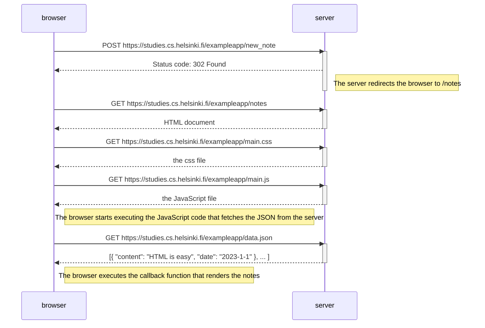
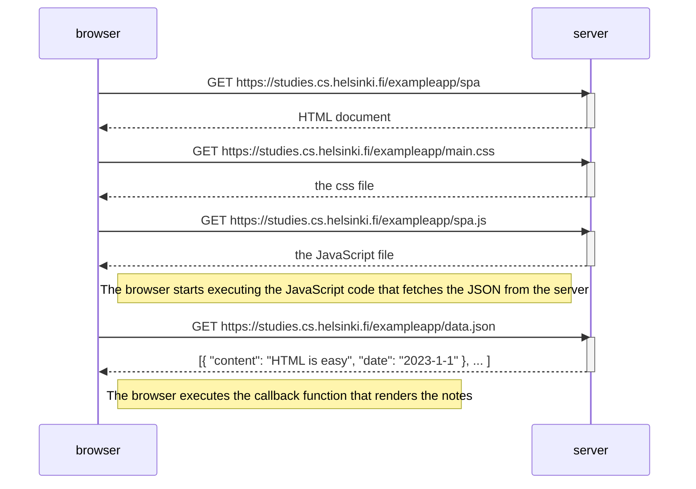

# fullstackopen-part0

> Helsinki University [Full Stack Open Course](https://fullstackopen.com/) Part0

# Exercises

## 0.4: New note

In chapter [Loading a page containing JavaScript - review](https://fullstackopen.com/en/part0/fundamentals_of_web_apps#loading-a-page-containing-java-script-review) the chain of events caused by opening the page https://studies.cs.helsinki.fi/exampleapp/notes is depicted as a [sequence diagram](https://www.geeksforgeeks.org/unified-modeling-language-uml-sequence-diagrams/)

The diagram was made using [websequencediagrams](https://www.websequencediagrams.com/) service as follows:

```text
sequenceDiagram
    participant browser
    participant server

    browser->>server: GET https://studies.cs.helsinki.fi/exampleapp/notes
    activate server
    server-->>browser: HTML document
    deactivate server

    browser->>server: GET https://studies.cs.helsinki.fi/exampleapp/main.css
    activate server
    server-->>browser: the css file
    deactivate server

    browser->>server: GET https://studies.cs.helsinki.fi/exampleapp/main.js
    activate server
    server-->>browser: the JavaScript file
    deactivate server

    Note right of browser: The browser starts executing the JavaScript code that fetches the JSON from the server

    browser->>server: GET https://studies.cs.helsinki.fi/exampleapp/data.json
    activate server
    server-->>browser: [{ "content": "HTML is easy", "date": "2023-1-1" }, ... ]
    deactivate server

    Note right of browser: The browser executes the callback function that renders the notes
```

**Create a similar diagram** depicting the situation where the user creates a new note on page https://studies.cs.helsinki.fi/exampleapp/notes when writing something into the text field and clicking the _submit_ button.

If necessary, show operations on the browser or on the server as comments on the diagram.

The diagram does not have to be a sequence diagram. Any sensible way of presenting the events is fine.

All necessary information for doing this, and the next two exercises, can be found from the text of [this part](https://fullstackopen.com/en/part0/fundamentals_of_web_apps#forms-and-http-post). The idea of these exercises is to read the text through once more, and to think through what is going on there. Reading the application [code](https://github.com/mluukkai/example_app) is not necessary, but it is of course possible.

## Solution to 0.4: New Note Sequence Diagram:


# 0.5: Single page app diagram
Create a diagram depicting the situation where the user goes to the [single-page](https://fullstackopen.com/en/part0/fundamentals_of_web_apps#single-page-app) app version of the notes app at https://studies.cs.helsinki.fi/exampleapp/spa.

## Solution to 0.5: Single page app diagram:


